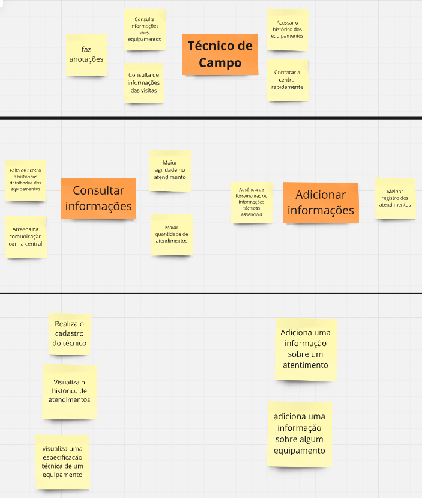

# **PBB**

Nessa sessão iremos apresentar o PBB feito a partir do estudo de caso feito em sala, além das histórias de usuario geradas a partir dele,  os critérios para a priorização foram definidos a partir do valor de negócio (importância da funcionalidade) e dificuldade técnica.
 
Aqui estão as personas indentificadas no PBB

Para visualizar o quadro inteiro no miro [clique aqui](https://miro.com/welcomeonboard/bkJ0RkVGcEo3ckYzalRWc3A4bUo1VW8wTWdrTVE5Q2tNVFpMUzRwSmd2QTAvbXh5a0NKRVRsb0wweUhUY3YvSmZwOEgwbnJ2TVNRNVRldlJKVHg1VURhaDhnZlFJc1JUVmhkdzVvRldmWlFBdUpNLzdvWm1wYXczbk45YWNDUWYhZQ==?share_link_id=955382334203)

**História de usuário**

RF1-Título: Realizar cadastro de técnico  
Como um(a): Técnico de Campo  
Eu quero: Realizar meu cadastro na plataforma da TechFix  
Para que: Eu possa acessar a plataforma  
Critérios de aceitação:  
Os dados de entrada são nome,CPF e senha.  
Ao terminar o cadastro o Técnico é direcionado a tela de atendimento.  
No caso de alguma falha o Técnico deve receber uma resposta do sistema informando qual campo foi preenchido errado.  

BDD:   
Cenário : Cadastro de técnico com os dados válidos.  
Dado que estou na página  de cadastro de técnico 
e insiro nome   
e CPF  
e senha   
Quando clico no botão cadastrar,   
Então o técnico é cadastrado com sucesso e redirecionado a tela de atendimento.

Cenário : Cadastro com dados inválidos.  
Dado que estou na página  de cadastro de técnico   
e não insiro nome  
	ou CPF  
ou senha  
Então vejo uma mensagem de erro informando qual campo não foi preenchido
e permaneço na página de cadastro 
	
RF2 - Título: Visualizar o histórico de atendimentos  
Como um(a): Técnico de Campo  
Eu quero: Acessar o histórico de atendimentos  
Para que: Eu possa ver as informações dos atendimentos passados  
Critérios de aceitação:  
 O técnico deve ter total acesso aos históricos de atendimentos.  
O técnico deve possuir a capacidade de filtrar o atendimento por data, cliente e tipo de atendimento, caso o usuário coloque um filtro inválido o sistema alerta.  
O sistema deve exibir apenas os atendimentos que correspondem aos critérios de filtragem que foram selecionados, caso não existam o sistema alerta. 

BDD:   
Cenário : Visualizar os histórico completo de atendimentos   
Dado que estou na página de histórico de atendimentos  
e não aplicar filtros  
Quando clico no botão buscar  
Então vejo um histórico com todos os atendimentos registrados  

Cenário :Filtro inválido  
Dado que estou na página de histórico de atendimentos    
e insiro critérios inválidos como data final menor que inicial  
Quando clico no botão buscar   
Então vejo uma mensagem informando filtros inválidos revise os campos preenchidos  
e continuo na página de histórico de atendimentos

RF3 -Título: Visualizar Informações dos equipamentos  
Como um(a): Técnico de Campo  
Eu quero: Ter acesso a todas informações referente aos equipamentos  
Para que: Eu possa conseguir visualizar as informações dos equipamentos de forma prática  
Critérios de aceitação:  
O técnico é capaz de visualizar as informações de um equipamento a partir do seu nome ou número de série  
Caso um equipamento não seja encontrado o sistema deve enviar uma mensagem informando o técnico  
Todo equipamento deve ter informações sobre seu hardware e seu funcionamento  

BDD:   
Cenário : Visualizar as informações de um equipamento pelo nome.  
Dado que estou na página de consulta de equipamentos   
e insiro nome do equipamento “Chave de fenda”  
Quando clico no botão buscar  
Então vejo as informações completas sobre o funcionamento do equipamento  

Cenário : Equipamento não encontrado por consulta pelo número de série.
Dado que estou na página de consulta de equipamentos  
e insiro um número de série não existente
Quando clico no botão buscar 
Então vejo uma mensagem informando “Equipamento não encontrado”

RF4 - Título: Adicionar informações sobre os atendimentos  
Como um(a): Técnico de Campo  
Eu quero: Adicionar informações sobre um atendimento  
Para que: Eu tenha uma fonte de registro fácil assim sendo gerados relatórios precisos   
Critérios de aceitação:  
O técnico é capaz de relatar problemas gerais que possuem campos de seleção como hardware danificado, problema de atualização, problema de software , falta de conhecimento do cliente ou outros  
O técnico é capaz de relatar problemas específicos escrevendo o que aconteceu no atendimento, caso o problema atendido no agendamento não caiba nos campos pré existentes ou caso ele queira detalhar melhor o que aconteceu  

BDD:   
Cenário: Adicione informações gerais com campos de seleção.  
Dado que estou na página de atendimento  
e seleciono uma opção de hardware danificado  
ou problema de atualização  
ou problema de software  
ou falta de conhecimento do cliente   
Quando clico no botão adicionar dados  
Então o sistema salva a seleção com sucesso

Cenário : Adicionando informações sem os campos.  
Dado que estou na página de atendimento  
e o problema do agendamento não se encaixa em nenhuma das opções gerais disponíveis  
Quando escrevo uma descrição detalhada do problema  
Então o sistema salva a descrição  

RF5 - Título: Adicionar informação dos equipamentos  
Como um(a): Técnico de Campo  
Eu quero: Adicionar informação sobre algum equipamento  
Para que: Eu possa ter essa informação futuramente  
Critérios de aceitação:  
O técnico é capaz de adicionar informações a algum equipamento específico, essas informações são apenas informações gerais sobre como lidar melhor com aquele equipamento  
As informações adicionais são visíveis somente aquele técnico  

BDD:   
Cenário: Adicionar informações gerais sobre um equipamento.   
Dado estou na página de detalhes de um equipamento,   
e o equipamento específico está selecionado   
Quando adiciono informações gerais sobre como lidar melhor com o equipamento no campo designado  
e clico no botão salvar   
Então o sistema salva essas informações com sucesso  

Cenário: Garantir visibilidade das informações apenas ao técnico
responsável.   
Dado que adiciono informações gerais sobre um equipamento   
e outro técnico acessa o mesmo equipamento   
Quando o sistema exibe os detalhes do equipamento   
Então as informações adicionadas são visíveis apenas para o técnico que as registrou  

RF6 - Título: Realizar cadastro de Cliente corporativo  
Como um(a): Cliente corporativo   
Eu quero: Realizar meu cadastro na plataforma da TechFix  
Para que: Eu possa acessar a plataforma  
Critérios de aceitação:  
Os dados de entrada são nome,CPF, endereço, tipo de cliente (corporativo neste caso).  
Ao terminar o cadastro o cliente é direcionado a tela inicial.  
No caso de alguma falha o cliente deve receber uma resposta do sistema informando qual campo foi preenchido errado.  

RF7 - Título: Realizar agendamento  
Como um(a): Cliente corporativo   
Eu quero: Realizar um agendamento de uma visita técnica  
Para que: Eu possa agendar minhas próprias visitas de forma rápida  
Critérios de aceitação:  
Os dados de entrada da solicitação são a data e o local do agendamento, além do nome de quem receberá o técnico.  
Caso algum dado seja inválido ou a data não esteja mais disponível, o sistema deve enviar uma mensagem alertando o erro.  
Além dos dados do agendamento, o cliente tem um campo de texto para explicar alguma especificação do agendamento.  

RF8 - Título: Receber plano de ação  
Como um(a): Cliente corporativo  
Eu quero: Receber um plano de ação  
Para que: Eu saiba o que será realizado durante o atendimento
Critérios de aceitação:

RF8 - Título: Receber relatório do atendimento  
Como um(a): Cliente corporativo  
Eu quero: Receber um relatório do atendimento  
Para que: Saber o que foi durante o atendimento  
Critérios de aceitação:

RF9 - Título: Realizar avaliação do atendimento  
Como um(a):  Cliente corporativo  
Eu quero: Avaliar o atendimento  
Para que: Eu tenha minhas críticas e sugestões ouvidas  
Critérios de aceitação:

RF10 -Título: Realiza o Cadastro da Diretora  
Como um(a): Diretora de Operações  
Eu quero: Realiza o meu cadastro na plataforma da TechFix  
Para que: Eu possa ter acesso a plataforma  
Critérios de aceitação:

RF11 -Título: Acessar os Dashboards  
Como um(a): Diretora de Operações  
Eu quero: Visualizar Dashboards a partir das informações dos clientes e técnicos  
Para que: Eu possa melhorar a eficiência operacional
Critérios de aceitação:

RF12 -Título: Filtrar os dados  
Como uma: Diretora de Operações  
Eu quero: Ter a possibilidade de filtrar todos os dados do sistema  
Para que: Eu possa visualizar e comparar esses dados  
Critérios de aceitação:
