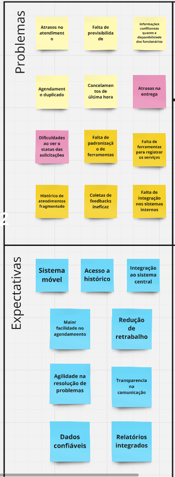
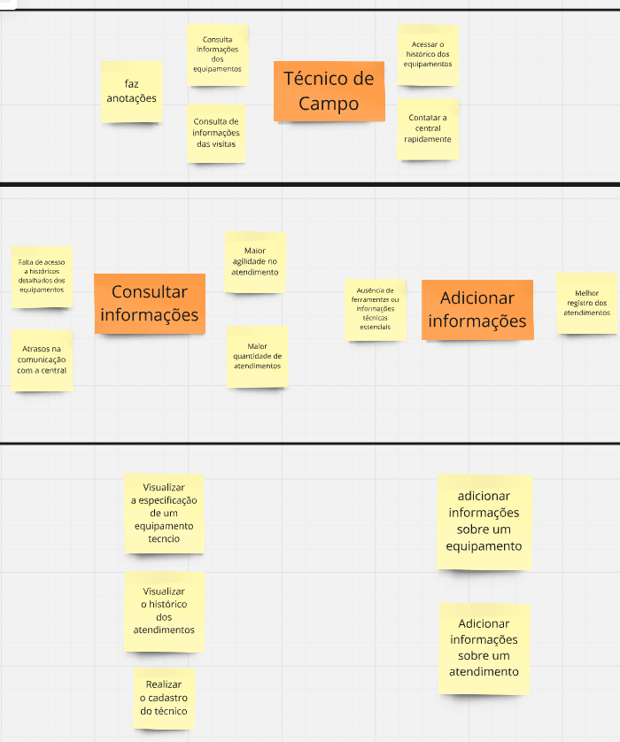

# **PBB**

Nessa sessão iremos apresentar o PBB feito a partir do estudo de caso feito em sala, além das histórias de usuario geradas a partir dele,  os critérios para a priorização foram definidos a partir do valor de negócio (importância da funcionalidade) e dificuldade técnica.

aqui estão os problemas e expectativas gerados no PBB

  
 
Aqui estão as personas indentificadas no PBB 

  

  

  

Para visualizar o quadro inteiro no miro [clique aqui](https://miro.com/welcomeonboard/bkJ0RkVGcEo3ckYzalRWc3A4bUo1VW8wTWdrTVE5Q2tNVFpMUzRwSmd2QTAvbXh5a0NKRVRsb0wweUhUY3YvSmZwOEgwbnJ2TVNRNVRldlJKVHg1VURhaDhnZlFJc1JUVmhkdzVvRldmWlFBdUpNLzdvWm1wYXczbk45YWNDUWYhZQ==?share_link_id=955382334203)

**História de usuário**
RF1-Título: Realizar cadastro de técnico  
Como um(a): Técnico de Campo  
Eu quero: Realizar meu cadastro na plataforma da TechFix  
Para que: Eu possa acessar a plataforma  
Critérios de aceitação:  
Os dados de entrada são nome,CPF e senha.  
Ao terminar o cadastro o Técnico é direcionado a tela de atendimento.  
No caso de alguma falha o Técnico deve receber uma resposta do sistema informando qual campo foi preenchido errado por meio de uma mensagem de texto.  

BDD:   
Cenário : Cadastro de técnico com os dados válidos.  
Dado que estou na página  de cadastro de técnico   
e insiro o nome João   
e CPF 16747527259  
e senha Paparduel23**  
Quando clico no botão cadastrar,   
Então o técnico é cadastrado com sucesso e redirecionado a tela de atendimento.  

Cenário : Cadastro com dados inválidos.  
Dado que estou na página  de cadastro de técnico   
e não insiro o nome 123  
	ou CPF 16747527259  
ou senha Paparduel23**  
Então vejo uma mensagem de erro informando que o campo de nome não foi preenchido corretamente  
e permaneço na página de cadastro   
	
RF2 - Título: Visualizar o histórico de atendimentos  
Como um(a): Técnico de Campo  
Eu quero: Acessar o histórico de atendimentos  
Para que: Eu possa ver as informações dos atendimentos passados  
Critérios de aceitação:    
O técnico deve possuir a capacidade de filtrar o atendimento por data, cliente e tipo de atendimento,ou mais de um ao mesmo tempo  
O sistema deve exibir apenas os atendimentos que correspondem aos critérios de filtragem que foram selecionados, caso não existam o sistema alerta com uma mensagem de texto.  

BDD:   
Cenário : Visualizar os histórico completo de atendimentos   
Dado que estou na página de histórico de atendimentos  
e não aplicar filtros  
Quando clico no botão buscar  
Então vejo um histórico com todos os atendimentos registrados  

Cenário :Filtro aplicado  
Dado que estou na página de histórico de atendimentos    
e insiro um filtro por datas anteriores a dia 03/02/2025  
Quando clico no botão buscar   
Então vejo um histórico apenas com os atendimentos que ocorreram antes da data 03/02/2025  
e continuo na página de histórico de atendimentos  

Cenário :atendimento não encontrado  
Dado que estou na página de histórico de atendimentos    
e insiro um filtro por datas anteriores a dia 03/02/2025  
Quando clico no botão buscar   
Então Não existem atendimentos feitos antes da data 03/02/2025, logo o sistema alerta por uma mensagem de texto informando que não existem atendimentos para este filtro  
e continuo na página de histórico de atendimentos

RF3 -Título: Visualizar Informações dos equipamentos  
Como um(a): Técnico de Campo  
Eu quero: Ter acesso a todas informações referente aos equipamentos  
Para que: Eu possa conseguir visualizar as informações dos equipamentos de forma prática  
Critérios de aceitação:  
O técnico é capaz de visualizar as informações de um equipamento como nome, número de série,modelo,ano a partir do seu nome ou número de série  
Caso um equipamento não seja encontrado o sistema deve enviar uma mensagem informando o técnico  
Todo equipamento deve ter informações sobre seu hardware e seu funcionamento através do seu manual oficial 

BDD:   
Cenário : Visualizar as informações de um equipamento pelo nome.  
Dado que estou na página de consulta de equipamentos   
e insiro nome do equipamento servidor 001  
Quando clico no botão buscar  
Então vejo as informações completas sobre o equipamento sendo seu nome o número de série 123432142 seu modelo como servidor ghx2000, seu ano sendo 2019, seu manual de funcionamento e uma anotação feita por ele dizendo que esse equipamento esquenta com facilidade  

Cenário : Visualizar as informações de um equipamento pelo número de série.  
Dado que estou na página de consulta de equipamentos   
e insiro número de série do equipamento 123432142  
Quando clico no botão buscar  
Então vejo as informações completas sobre o equipamento sendo seu nome como servidor 0001 número de série seu modelo como servidor ghx2000 , seu ano sendo 2019 ,seu manual de funcionamento e uma anotação feita por ele dizendo que esse equipamento esquenta com facilidade  

RF4 - Título: Adicionar informações sobre os atendimentos  
Como um(a): Técnico de Campo  
Eu quero: Adicionar informações sobre um atendimento  
Para que: Eu tenha uma fonte de registro fácil assim sendo gerados relatórios precisos   
Critérios de aceitação:  
O técnico é capaz de relatar problemas gerais que possuem campos de seleção como hardware danificado, problema de atualização, problema de software , falta de conhecimento do cliente ou outros  
O técnico é capaz de relatar problemas específicos escrevendo o que aconteceu no atendimento, caso o problema atendido no agendamento não caiba nos campos pré existentes ou caso ele queira detalhar melhor o que aconteceu  

BDD: 
Cenário: Adicione informações gerais com campos de seleção.  
Dado que estou na página de atendimento  
e seleciono uma opção de hardware danificado  
ou problema de atualização  
ou problema de software  
ou falta de conhecimento do cliente   
Quando clico no botão adicionar dados  
Então o sistema salva a seleção com sucesso  

Cenário : Adicionando informações sem os campos.  
Dado que estou na página de atendimento  
e o problema do agendamento não se encaixa em nenhuma das opções gerais disponíveis  
Quando escrevo uma descrição detalhada do problema  
Então o sistema salva a descrição  

RF5 - Título: Adicionar informação dos equipamentos  
Como um(a): Técnico de Campo  
Eu quero: Adicionar informação sobre algum equipamento  
Para que: Eu possa ter essa informação futuramente  
Critérios de aceitação:  
O técnico é capaz de adicionar informações a algum equipamento específico, essas informações são apenas informações gerais sobre como lidar melhor com aquele equipamento, como a data da última troca de alguma peça   
As informações adicionais são visíveis somente aquele técnico  

BDD:   
Cenário: Adicionar informações gerais sobre um equipamento.   
Dado estou na página de detalhes de um equipamento,   
e o equipamento específico está selecionado como impressora 003, e    está sendo mostrado nome ,número de série como 40028922, seu modelo como lenovo ptw40, seu ano sendo 2021,seu manual de funcionamento e uma anotação feita por ele dizendo que esse equipamento geralmente tem problemas com tinta vazando  
Quando adiciono informações gerais sobre como lidar melhor com o equipamento no campo designado como por exemplo “o vazamento é geralmente fruto de um parafuso frouxo na parte de trás da impressora”  
e clico no botão salvar   
Então o sistema salva essas informações com sucesso  

RF6 - Título: Realizar cadastro de Cliente corporativo  
Como um(a): Cliente corporativo   
Eu quero: Realizar meu cadastro na plataforma da TechFix  
Para que: Eu possa acessar a plataforma  
Critérios de aceitação:  
Os dados de entrada são nome,CPF, endereço, tipo de cliente (corporativo neste caso).  
Ao terminar o cadastro o cliente é direcionado a tela inicial.  
No caso de alguma falha o cliente deve receber uma resposta do sistema informando qual campo foi preenchido errado.  

RF7 - Título: Realizar agendamento  
Como um(a): Cliente corporativo   
Eu quero: Realizar um agendamento de uma visita técnica  
Para que: Eu possa agendar minhas próprias visitas de forma rápida  
Critérios de aceitação:  
Os dados de entrada da solicitação são a data e o local do agendamento, além do nome de quem receberá o técnico.  
Caso algum dado seja inválido ou a data não esteja mais disponível, o sistema deve enviar uma mensagem alertando o erro.  
Além dos dados do agendamento, o cliente tem um campo de texto para explicar alguma especificação do agendamento.  

RF8 - Título: Receber plano de ação  
Como um(a): Cliente corporativo  
Eu quero: Receber um plano de ação  
Para que: Eu saiba o que será realizado durante o atendimento  

RF8 - Título: Receber relatório do atendimento  
Como um(a): Cliente corporativo  
Eu quero: Receber um relatório do atendimento  
Para que: Saber o que foi durante o atendimento  

RF9 - Título: Realizar avaliação do atendimento  
Como um(a):  Cliente corporativo  
Eu quero: Avaliar o atendimento  
Para que: Eu tenha minhas críticas e sugestões ouvidas  

RF10 -Título: Realiza o Cadastro da Diretora  
Como um(a): Diretora de Operações  
Eu quero: Realiza o meu cadastro na plataforma da TechFix  
Para que: Eu possa ter acesso a plataforma  

RF11 -Título: Acessar os Dashboards  
Como um(a): Diretora de Operações  
Eu quero: Visualizar Dashboards a partir das informações dos clientes e técnicos  
Para que: Eu possa melhorar a eficiência operacional

RF12 -Título: Filtrar os dados  
Como uma: Diretora de Operações  
Eu quero: Ter a possibilidade de filtrar todos os dados do sistema  
Para que: Eu possa visualizar e comparar esses dados  
