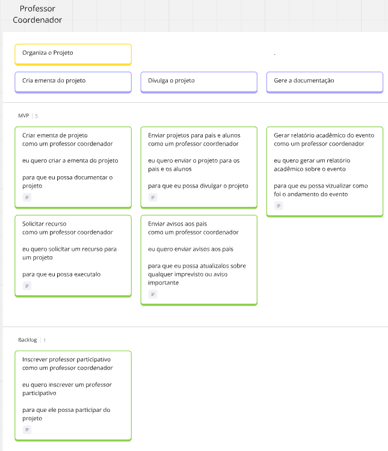
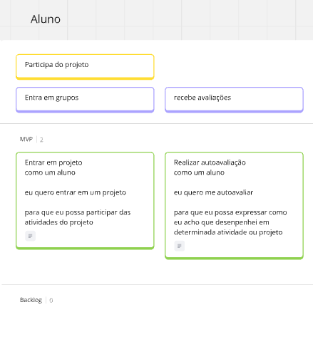
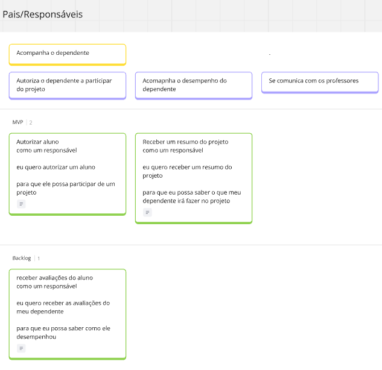
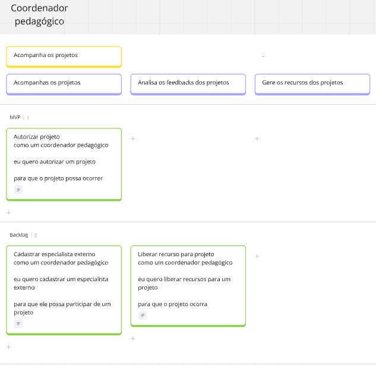

# **User Story Map**

Nessa sessão iremos apresentar o User Story Map feito a partir do estudo de caso feito em sala, os critérios para a priorização foram definidos a partir do valor de negócio (importância da funcionalidade) e dificuldade técnica.

A formula final foi B-A, sendo B o valor de negócio e A a dificuldade técnica, os dois valores variam de 1 a 5.

Aqui estão as personas indentificadas no estudo de caso

Para visualizar o quadro inteiro no miro [clique aqui](https://miro.com/welcomeonboard/OUtnT1RaV1VIdlAxeGVCeDJnMDhYYy91VUpBYTJDM296dXdJOFRCMVlnNHppSHVQWWFEYXhpTGZrUERnZE1saGJWalFkMGhRNllSV011THhERWNPWktqb2tpajh6N2dUaTNLY1ltU29jK1p5bzZBU29XVWJLdnFaZlQ2QUJnaHIhZQ==?share_link_id=460950000281)

