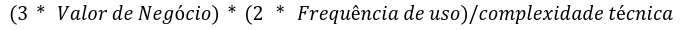

### 9.1 **Backlog Geral**
Nosso backlog foi estruturado utilizando histórias de usuário para garantir clareza e foco nas necessidades do negócio e dos usuários finais. As histórias seguem um formato padronizado, começando pela identificação do ator (*Como um(a):*), o objetivo (*Eu quero:*) e o benefício esperado (*Para que:*), assegurando que cada item esteja alinhado com o propósito do sistema. Além disso, cada história inclui critérios de aceitação bem definidos, que detalham os comportamentos esperados, como validações, respostas a falhas, e condições específicas de funcionamento. Esse padrão facilita a priorização, promove um entendimento comum entre os membros do time e stakeholders, e serve como base para validação durante o desenvolvimento, garantindo que as entregas atendam às expectativas de qualidade e funcionalidade.(Caso queira visualizar o backlog completo [Veja o quadro do Miro](https://miro.com/app/embed/uXjVL4APDBU=/?pres=1&frameId=3458764610726700753&embedId=848713241918))

RF1 - Titulo: Realizar Login    
Como um(a): Dono do Negócio     
Eu quero:Realizar um login rápido e seguro no sistema   
Para que: Eu confie os meus dados na aplicação  
Critérios de aceitação:     
1-No caso de alguma falha o usuário deve receber uma resposta do sistema informando qual campo não foi preenchido corretamente.       
2-Os dados de entrada que são CPF e senha devem ser conferidos e devem ser únicos por usuário.        
3-O sistema deve manter o usuário logado por, no mínimo, 24 horas, a menos que ele escolha explicitamente sair (logout).      
4-Ao fazer login com sucesso, o usuário deve ser redirecionado para a página inicial da aplicação, com uma mensagem de boas-vindas.       

RF2 - Titulo: Cadastro de Produto       
Como um(a): Dono do Negócio     
Eu quero:Cadastrar um produto       
Para que: Eu adicione novos produtos de forma rápida e prática      
Critérios de aceitação:     
1-O cadastro do produto deve ser concluído em, no máximo, 3 etapas na interface.      
2-O sistema deve permitir que o dono do negócio cadastre um produto informando, no mínimo: nome, quantidade e descrição .     
3-O preço deve aceitar apenas valores numéricos positivos, incluindo casas decimais.       
4-Deve ser possível representar quantidades fracionadas de algum produto (Meio pacote).       
5-Após o cadastro bem-sucedido, o sistema deve exibir uma mensagem de sucesso.    
6-Caso algum campo obrigatório esteja ausente ou inválido, o sistema deve exibir uma mensagem clara indicando o problema.      

RF3 - Título: Pesquisa de Produto       
Como um(a): Dono do Negócio     
Eu quero:Pesquisar um produto       
Para que: Eu saiba a quantidade dos produtos e possa me planejar        
Critérios de aceitação:     
1-O sistema deve permitir a pesquisa de produtos pelo nome completo ou parcial.     
2-A pesquisa deve ser acionada ao pressionar a tecla "Enter" ou clicar em um botão "Buscar".      
3-Caso nenhum produto seja encontrado, o sistema deve exibir a mensagem "Nenhum produto encontrado".      

RF4 - Título: Exclusão de Produto       
Como um(a): Dono do Negócio     
Eu quero:Excluir um produto     
Para que: Eu não tenha produtos desnecessários me confundindo na hora de avaliar meu estoque        
Critérios de aceitação:     
1-O sistema deve exibir uma mensagem de confirmação antes de excluir o produto.       
2-A exclusão só deve ocorrer após o usuário confirmar a ação..
O preço deve aceitar apenas valores numéricos positivos, incluindo casas decimais.       
3-O botão de exclusão deve ser visível, mas não deve ser facilmente clicado acidentalmente.       
4-Após a exclusão do produto, ele não deve mais aparecer na lista de produtos.      

RF5 - Título: Atualização de Produto        
Como um(a): Dono do Negócio     
Eu quero:Atualizar os dados de um produto       
Para que: Eu mantenha a quantidade dos produtos correta e não compre nada a mais ou a menos     
Critérios de aceitação:     
1-O sistema deve permitir que o dono do negócio atualize as informações do produto, incluindo: nome, descrição e quantidade em estoque.     
2-A edição deve ser feita a partir de uma lista de produtos, onde cada item tenha a opção "Editar".     
3-O sistema deve validar os dados atualizados antes de salvar.      
4-Após salvar as alterações, o sistema deve exibir uma mensagem de sucesso  
5-Em caso de erro, uma mensagem clara deve ser exibida, indicando o motivo.     
6-O formulário de edição deve carregar os dados atuais do produto para facilitar a atualização.     
7-Deve haver um botão "Salvar" para confirmar a atualização e um botão "Cancelar" para descartar as alterações.     
8-As alterações realizadas devem refletir imediatamente na lista de produtos e no estoque.                

RF6 - Título: Ordenar produtos por quantidade       
Como um(a): Dono do Negócio     
Eu quero: Ordenar produtos por quantidade       
Para que: Eu consiga saber quais produtos eu tenha me maior quantidade, facilitando na hora de comprar novos produtos       
Critérios de aceitação:     
1-O sistema deve permitir ordenar os produtos por quantidade em estoque, tanto em ordem crescente quanto decrescente.       
2-A ordenação deve ser acionada através de botões ou opções claramente identificadas.       
3-Após aplicar a ordenação, os produtos devem ser exibidos na nova ordem escolhida, sem a necessidade de recarregar a página.       
4-O sistema deve manter a ordenação selecionada enquanto o usuário estiver navegando na lista de produtos.

RF7 - Título: Cadastro de Evento        
Como um(a): Dono do Negócio     
Eu quero: Cadastrar um Evento       
Para que: Eu fique ciente dos eventos futuros e possa me organizar      
Critérios de aceitação:     
1-O sistema deve permitir que o dono do negócio cadastre um evento informando, no mínimo: nome, data, horário, local, quantidade de pessoas e descrição.        
2-O cadastro deve ser concluído em até 3 etapas na interface ou em uma única tela.      
3-Deve haver um botão "Salvar" para confirmar o cadastro e outro "Cancelar" para descartar as informações.      
4-Após salvar, o evento deve ser exibido em uma lista ou calendário na tela principal dos eventos.      
5-Após o cadastro bem-sucedido, o sistema deve exibir uma mensagem de confirmação.      
6-Em caso de erro, o sistema deve exibir mensagens específicas para cada problema.      

RF8 - Titulo: Cadastro de Gastos do evento      
Como um(a): Dono do Negócio     
Eu quero: Cadastrar os Gastos de um evento      
Para que: saiba o quanto eu gastei em um evento, seja com funcionário ou com matéria prima      
Critérios de aceitação:     
1-O sistema deve permitir que o dono do negócio associe gastos a um evento previamente cadastrado.        
2-Para cada gasto, devem ser informados: tipo de gasto (ex.: funcionário, matéria-prima), descrição, valor, e data.       
3-O campo "Valor" deve aceitar apenas valores numéricos positivos, com suporte a casas decimais       
4-Após o cadastro bem-sucedido, o sistema deve exibir uma mensagem de confirmação.        
5-Caso ocorra algum erro, o sistema deve informar claramente o motivo.        

RF9 -Título: Cadastro de Ganhos do Evento       
Como um(a): Dono do Negócio     
Eu quero:Cadastrar os ganhos de um evento       
Para que: Eu saiba o quanto eu vendi e possa avaliar a efetividade do evento        
Critérios de aceitação:     
1-O sistema deve permitir que o dono do negócio registre os ganhos relacionados a um evento específico.       
2-Para cada ganho, o sistema deve solicitar: descrição do ganho (ex.: vendas de ingressos, vendas de produtos), valor arrecadado e data.      
3-O campo "Valor" deve aceitar apenas valores numéricos positivos, com suporte a casas decimais.      
4-Após o cadastro bem-sucedido, o sistema deve exibir uma mensagem de confirmação.        
5-Caso ocorra algum erro, o sistema deve informar claramente o motivo.        

RF10 - Título: Gerar Relatório Referente aos Ganhos e Gastos do evento      
Como um(a): Dono do Negócio     
Eu quero: Gerar relatórios sobre  os ganhos e gastos dos eventos        
Para que: Eu possa avaliar a lucratividade e tomar decisões estratégicas        
Critérios de aceitação:     
1-O sistema deve gerar relatórios detalhados contendo:Nome do evento,Total de ganhos, Total de gastos, Balanço final (lucro ou prejuízo), Lista detalhada de ganhos e gastos, incluindo data, descrição e valores.        
2-O relatório deve ser exibido na tela em um formato organizado e fácil de visualizar (ex.: tabelas ou gráficos).     
3-O sistema deve destacar o balanço final (lucro ou prejuízo) de forma clara, com cores diferenciadas (ex.: verde para lucro, vermelho para prejuízo).        
4-O sistema deve permitir a exportação do relatório nos formatos PDF e Excel.     
5-Após a geração, o relatório deve ser armazenado na interface do sistema para consulta posterior.        

RF11 - Título: Pesquisar Eventos Passados       
Como um(a): Dono do Negócio     
Eu quero: Pesquisar eventos passados        
Para que: Eu possa acessar informações relevantes e relacionados a eventos passados     
Critérios de aceitação:     
1-O sistema deve permitir que o dono do negócio pesquise eventos passados usando tanto nome como períodos ou datas.       
2-A lista de resultados deve exibir: nome, data, local do evento, relatório financeiro (se disponível).       
3-A interface deve indicar claramente quando nenhum evento correspondente for encontrado      

RF12 - Título: Pesquisar Eventos Futuros        
Como um(a): Dono do Negócio     
Eu quero: Pesquisar eventos futuros     
Para que: Eu possa acessar informações relevantes e planejar melhor as ações relacionadas aos próximos eventos.     
Critérios de aceitação:     
1-O sistema deve permitir que o dono do negócio pesquise eventos futuros usando tanto nome como períodos ou datas.    
2-A lista de resultados deve exibir: nome, data, local do evento.     
3-A interface deve indicar claramente quando nenhum evento correspondente for encontrado      

RF13 - Título: Atualizar dados dos eventos  
Como um(a): Dono do Negócio      
Eu quero: Atualizar os dados de eventos cadastrados     
Para que: Eu possa corrigir informações ou refletir alterações no planejamento      
Critérios de aceitação:     
1-O sistema deve permitir que o dono do negócio atualize as seguintes informações de um evento: nome, data , local, horário, quantidade de pessoas, gastos e ganhos.      
2-Deve haver um botão ou link "Editar" ao lado de cada evento listado.        
3-O formulário de edição deve exibir os dados atuais do evento, permitindo alterações em campos específicos.      
4-O sistema deve validar as informações atualizadas antes de salvar.      
5-Após salvar as alterações, o sistema deve exibir uma mensagem de sucesso        
6-Se o usuário cancelar a edição, o sistema deve descartar as alterações e manter os dados originais intactos.        

RF14 - Título: Cadastro de Funcionário      
Como um(a): Dono do Negócio     
Eu quero: Cadastrar novos funcionários no sistema       
Para que: Eu possa gerenciar informações da equipe com eficiência        
Critérios de aceitação:     
1-O sistema deve permitir que o dono do negócio cadastre novos funcionários preenchendo os seguintes campos obrigatórios: Nome, telefone de contato.      
2-O sistema deve permitir que o dono do negócio avalie os funcionários de uma forma simples o desempenho e a pontualidade dos funcionários        
3-Após o cadastro, o sistema deve exibir uma mensagem de sucesso.     
4-Caso ocorra um erro, o sistema deve exibir uma mensagem clara com a razão do erro.      
5-As informações cadastradas devem ser armazenadas corretamente no banco de dados, garantindo a integridade e disponibilidade dos dados.      
6-O sistema deve impedir o cadastro de funcionários com informações incompletas ou incorretas.        

RF15 - Título: Excluir funcionário      
Como um(a): Dono do Negócio     
Eu quero: Excluir funcionários que não fazem mais parte da empresa      
Para que: Eu possa manter o cadastro atualizado     
Critérios de aceitação:     
1-O sistema deve permitir que o dono do negócio exclua um funcionário selecionado na lista de funcionários cadastrados.       
2-Antes de excluir, o sistema deve exibir uma mensagem de confirmação.        
3-Deve haver botões de confirmação e cancelamento claramente identificados.       
4-O sistema não deve permitir a exclusão de funcionários vinculados a eventos futuros.        
5-Caso o funcionário não possa ser excluído, o sistema deve exibir uma mensagem clara explicando o por que.       
6-Após uma exclusão bem-sucedida, o sistema deve exibir uma mensagem de confirmação.      

RF16 - Título: Atualizar dados dos funcionários     
Como um(a): Dono do Negócio     
Eu quero: Atualizar as informações dos funcionários     
Para que: Eu possa corrigir dados ou adicionar novas informações relevantes.        
Critérios de aceitação:     
1-O sistema deve permitir que o dono do negócio edite as informações de um funcionário previamente cadastrado.        
2-O sistema deve permitir a atualização de todos os dados e das avaliações do funcionário.        
3-O sistema deve validar os dados atualizados.        
4-Após salvar as alterações, o sistema deve exibir uma mensagem de sucesso.       
5-Caso ocorra um erro, deve ser exibida uma mensagem clara com o motivo do erro.      
6-O sistema deve exibir um botão ou link claramente identificado como "Editar" ao lado de cada funcionário na lista.      

RF17 - Título: Registro de Pagamento de funcionário     
Como um(a): Dono do Negócio     
Eu quero: Registrar pagamentos de funcionários      
Para que: Eu possa controlar as finanças e garantir o histórico de pagamentos.      
Critérios de aceitação:     
1-O sistema deve permitir que o dono do negócio registre pagamentos realizados para cada funcionário.     
2-O sistema deve validar o valor do pagamento, apenas valores positivos decimais ou não.      
3-Após registrar o pagamento, o sistema deve exibir uma mensagem de sucesso.      
4-Caso ocorra um erro, deve ser exibida uma mensagem clara com o motivo do erro.      
5-O sistema deve permitir que o usuário visualize uma lista de pagamentos realizados, pesquisando por nome ou data.       

RF18 - Título: Pesquisar Funcionário        
Como um(a): Dono do Negócio     
Eu quero: Pesquisar informações de funcionários no sistema      
Para que: Eu possa acessar dados rapidamente quando necessário      
Critérios de aceitação:     
1-O sistema deve permitir que o dono do negócio pesquise informações de funcionários cadastrados utilizando diferentes critérios.     
2-A pesquisa deve aceitar os seguintes parâmetros: nome, telefone de contato, desempenho e pontualidade.      
3-O sistema deve exibir uma lista com os funcionários que correspondem aos critérios de busca.        
4-Se nenhum funcionário for encontrado, o sistema deve exibir uma mensagem.        
5-Caso ocorra um erro, deve ser exibida uma mensagem clara com o motivo do erro.      

### 9.2 **Priorização**
Aqui está a fórmula usada para a priorização dos requisitos, com foco em valorizar significativamente a frequência de uso.

RF1 - Titulo: Realizar Login        
Valor de Negócio: 5     
Complexidade Técnica: 4     
Frequência de Uso: 1        
Prioridade: 7,5     

RF2 - Titulo: Cadastro de Produto       
Valor de Negócio: 5     
Complexidade Técnica: 2     
Frequência de Uso: 3        
Prioridade: 45      

RF3 - Título: Pesquisa de Produto       
Valor de Negócio: 5         
Dificuldade técnica: 3      
Frequência de Uso: 3        
Prioridade: 30

RF4 - Título: Exclusão de Produto       
Valor de Negócio: 3     
Complexidade Técnica: 3     
Frequência de Uso: 2                
Prioridade: 12

RF5 - Título: Atualização de Produto        
Valor de Negócio: 5     
Complexidade Técnica: 2     
Frequência de Uso: 2        
Prioridade: 30

RF6 - Título: Ordenar produtos por quantidade       
Valor de negócio: 5     
Complexidade Técnica: 3     
Frequência de Uso: 1        
Prioridade: 10

RF7 - Título: Cadastro de Evento        
Valor de negócio: 5     
Dificuldade técnica: 2      
Frequência de Uso: 2        
Prioridade: 30

RF8 - Titulo: Cadastro de Gastos do evento      
Valor de negócio: 5     
Dificuldade técnica: 2      
Frequência de Uso: 2        
Prioridade:30

RF9 -Título: Cadastro de Ganhos do Evento       
Valor de Negócio: 5     
Complexidade Técnica: 2     
frequência de uso: 2        
Prioridade: 20

RF10 - Título: Gerar Relatório Referente aos Ganhos e Gastos do evento      
Valor de Negócio: 5     
Complexidade Técnica:2      
frequência de uso: 2        
Prioridade: 30

RF11 - Título: Pesquisar Eventos Passados       
Valor de Negócio:5      
Complexidade Técnica:2      
frequência de uso: 3        
Prioridade: 45

RF12 - Título: Pesquisar Eventos Futuros        
Valor de Negócio:5      
Complexidade Técnica:3      
frequência de uso: 3        
Prioridade: 30

RF13 - Título: Atualizar dados dos eventos      
Valor de Negócio:5      
Complexidade Técnica:2      
frequência de uso: 2        
Prioridade: 30

RF14 - Título: Cadastro de Funcionário      
Valor de Negócio:5      
Complexidade Técnica:1      
frequência de uso:1     
Prioridade: 30      

RF15 - Título: Excluir funcionário      
Valor de Negócio: 4     
Complexidade técnica:1      
frequência de uso: 1        
Prioridade: 24

RF16 - Título: Atualizar dados dos funcionários     
Valor de Negócio:5      
Complexidade Técnica:1      
Frequência de Uso: 1        
Prioridade: 30

RF17 - Título: Registro de Pagamento de funcionário     
Valor de Negócio:5      
Complexidade Técnica:2      
Frequência de Uso: 1        
Prioridade: 15

RF18 - Título: Pesquisar Funcionário        
Valor de Negócio:5      
Complexidade Técnica:2      
Frequência de Uso: 1        
Prioridade: 30

### 9.3 **MVP**

Com base na priorização feita e visando entregar maior valor para o cliente nosso mvp será composto dos seguintes requisitos:

RF2 - Titulo: Cadastro de Produto

RF12 - Título: Pesquisar Eventos Futuros

RF11 - Título: Pesquisar Eventos Passados

RF3 - Título: Pesquisa de Produto

RF5 - Título: Atualização de Produto

RF10 - Título: Gerar Relatório Referente aos Ganhos e Gastos do evento

RF13 - Título: Atualizar dados dos eventos

RF14 - Título: Cadastro de Funcionário

RF15 - Título: Excluir funcionário

RF17 - Título: Registro de Pagamento de funcionário

RF7 - Título: Cadastro de Evento

RF8 - Titulo: Cadastro de Gastos do evento

RF9 -Título: Cadastro de Ganhos do Evento

RF16 - Título: Atualizar dados dos funcionários

- **Possiveis incrementos**

RF16 - Título: Atualizar dados dos funcionários

RF4 - Título: Exclusão de Produto

RF6 - Título: Ordenar produtos por quantidade

RF18 - Título: Pesquisar Funcionário

RF1 - Titulo: Realizar Login
