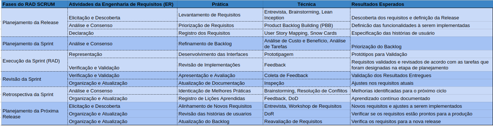

### 4.1 **Atividades e Técnicas da ER e RAD com Scrum**

Planejamento da Release
1. Elicitação e descoberta:     

 Entrevista: Entrevista com a cliente buscando entender a dinâmica do
negócio, identificar o problema, propor possíveis soluções, entender o
escopo do produto, as limitações e as dificuldades.    

brainstorm: Atividade realizada entre os membros da equipe a fim de
obter ideias para atender as necessidades do cliente e entender o tipo
de solução que iremos propor.       

lean inception: Atividade realizada a fim de entender melhor sobre o
nosso produto e o nosso cliente, tendo uma ideia inicial do que
queremos entregar ao final do projeto.      

2. análise consenso:

Product Backlog Building (PBB): O PBB será utilizado a fim de
entender o que é prioritário no nosso produto, assim entregando um
backlog inicial mais coeso.     

3. declaração:

User Story Mapping: Uma atividade feita para mostrar o fluxo do
Cliente para que todos entendam o que o nosso produto faz e assim
tenham uma ideia de como as funcionalidades se comportam na
prática.        

Snow Cards: Criar cards a fim de facilitar a visualização do backlog
para toda a equipe, assim todos terão a disposição uma visão clara
dos requisitos e suas prioridades.

Planejamento da Sprint
1. Análise e Consenso

Análise de custo e benefício: Analisar o quão difícil será atender as
demandas do projeto e verificar se o calendário está sendo seguido.

Análise de tarefas : Analisar se as tarefas designadas aos membros do
projeto estão ligadas a algum requisito que deve ser atendido na respectiva sprint.

Execução da Sprint (RAD)

1. Representação

Prototipagem: Prototipar através do figma um protótipo de alta fidelidade com
o que será entregue ao cliente, seguindo as práticas e as métricas definidas
nos requisitos não funcionais e com o cliente.

2. Verificação e Validação

Feedback: Obter o feedback do cliente sobre o protótipo feito na sprint para
começar a produção do artefato que irá atender o requisito.

Revisão da Sprint

1. Verificação e Validação

Coleta de feedback: Obter o feedback do cliente sobre o que foi entregue na
sprint, através de uma reunião mostrando o que foi entregue.

2. Organização e Atualização

Inspeção: Uma reunião a fim de entender se estamos de acordo com o
backlog e se o que foi entregue na sprint está devidamente atualizado no
backlog.

Retrospectiva da Sprint

1. Análise consenso

Brainstorming: Atividade realizada com a equipe para identificar quais
foram os principais desafios enfrentados e apontar novas ideias e
soluções, incentivando a participação de todos os membros.

Resolução de conflitos: Identificação dos conflitos que surgiram
durante a sprint, com o objetivo de encontrar as suas devidas
soluções.

2. Organização e Atualização

Feedback: Coleta de feedback da equipe e cliente com o objetivo de
melhorar os processos e desempenho da equipe para a próxima
sprint.

DoD: A equipe vai revisar se os critérios de DoD para os requisitos
estão sendo seguidos corretamente, garantindo que os requisitos
entregues na sprint atendam as expectativas de clareza, viabilidade
técnica e completude.

Planejamento da Próxima Release
1. Elicitação e Descoberta

Entrevista: Entrevista realizada com o cliente para planejar quais
serão os próximos passos, identificar necessidades e definir os
objetivos da próxima release.

Workshop de requisitos: Reuniões com o cliente para detalhar e
priorizar os requisitos, assegurando que todas as partes envolvidas
estejam alinhadas quanto às expectativas e entregas.

2. Organização e Atualização

DOR: Estabelecer critérios claros para garantir que os requisitos ou
histórias de usuários estejam prontos para serem trabalhados pela
equipe de desenvolvimento.

3. Organização e Atualização

Reavaliação de requisitos: Processo de revisar, se necessário ajustar
os requisitos existentes, levando em consideração o feedback do
cliente e a priorização. Essa etapa vai garantir que todos os requisitos
estejam atualizados e prontos para a implementação.

### 4.2 **Engenharia de Requisitos e o RADScrum**

