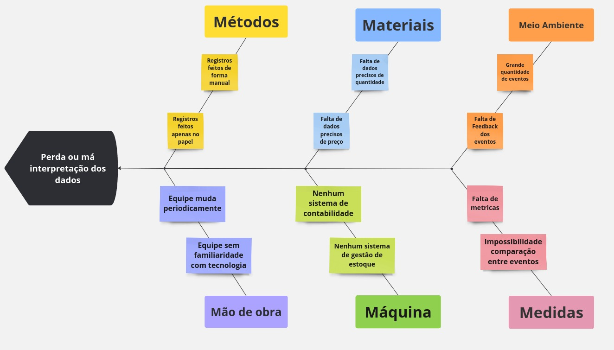

# **Visão do Produto e Projeto**
 
### 1.1 **Introdução ao Negócio e Contexto**

O Dida's Bistrô é um restaurante que realiza eventos privados, como festas e shows, com o objetivo de proporcionar experiências gastronômicas para seus clientes. Com um cardápio variado, adapta suas opções conforme a ocasião. Além disso, o Dida's Bistrô também atua como vendedor ambulante em shows e eventos em Brasília. 
 
Fundado em 2012, o negócio teve início com a venda de churros ambulante. Com o tempo, expandiu seu cardápio para incluir opções como hambúrguer, cachorro-quente, churrasquinho e macarrão. Hoje, o cardápio é flexível, permitindo que os pratos sejam ajustados conforme a demanda do evento. 

A partir de 2016, o Dida's Bistrô passou a organizar eventos privados, focando em festas juninas. Em 2022, recebeu o prêmio Sesc Comerciário Destaque, em reconhecimento pelas festas juninas realizadas nos Sesc de Brasília.

### 1.2 **Identificação da Oportunidade ou Problema**
O principal problema do Didas Bistrô é a perda de dados, causada pelo uso exclusivo de anotações em papel. Essas anotações são feitas por diferentes funcionários, sem qualquer padronização, e acabam se perdendo no meio de tantas informações, seja durante ou após os eventos. Além disso, é difícil armazená-las de forma organizada, o que impede o acesso rápido e eficiente aos dados de eventos anteriores.

Essa falta de informações estruturadas afeta a tomada de decisões, pois a equipe muitas vezes não sabe se vale a pena participar novamente de determinados eventos, quantos funcionários foram necessários, a quantidade de ingredientes utilizados ou até mesmo o total de vendas realizadas.

O problema também impacta a gestão do estoque, já que frequentemente não há um controle preciso das quantidades disponíveis. Isso compromete o planejamento para eventos futuros, dificultando tanto a organização quanto a eficiência do negócio.

Segue abaixo um diagrama de Ishikawa sobre os problemas do cliente.

### 1.3 **Desafios do Projeto**

O principal desafio técnico é que o Didas Bistrô atualmente não utiliza nenhum software para gerenciar seus processos. Não há nenhum sistema existente que atenda aos requisitos específicos do negócio. Por isso, será necessário desenvolver uma solução do zero, capaz de atender a todas as necessidades operacionais. Além disso, é essencial que o software tenha uma interface intuitiva e de fácil usabilidade, para que qualquer pessoa, independentemente de sua experiência, consiga utilizá-lo, já que, para cada evento, são contratados profissionais diferentes.
### 1.4 **Segmentação de Clientes**

O produto será destinado a dona e aos funcionários da empresa, na qual podemos dividir em dois segmentos: 
 
Idosos com mais de 60 anos:  Usuários com poucas experiências tecnológicas e que utilizam celular. Possuem a necessidade de um software com poucas interações para realizar o seu objetivo.  

Jovens adultos entre 20 e 30 anos: Usuários com experiências tecnológicas em computadores e celulares. Capazes de utilizar o software sem dificuldades. 

**Histórico de Revisão**

| **Data**   | **Versão** | **Descrição**                                                                         | **Autor**                                                                 |
| ---------- | ---------- | ------------------------------------------------------------------------------------- | ------------------------------------------------------------------------- |
| 08/11/2024 | 0\.0 | Criação do documento | Benjamim Lacerda |
| 11/11/2024 | 0\.1 | Atualização do Documento | Pedro Henrique |
| 11/11/2024 | 1\.0 | Primeira versão do documento | Benjamim Lacerda Santos, Iderlan Junio Cardoso da Silva, Mateus Henrique Queiroz Magalhães Sousa, Pedro Gois Marques Monteiro, Pedro Henrique |